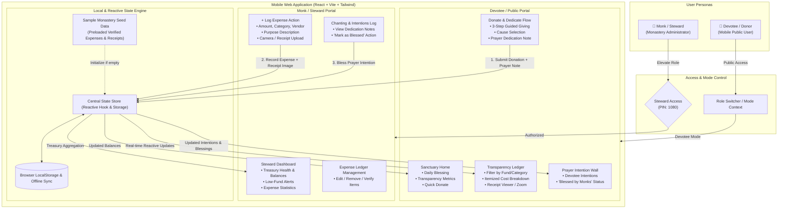
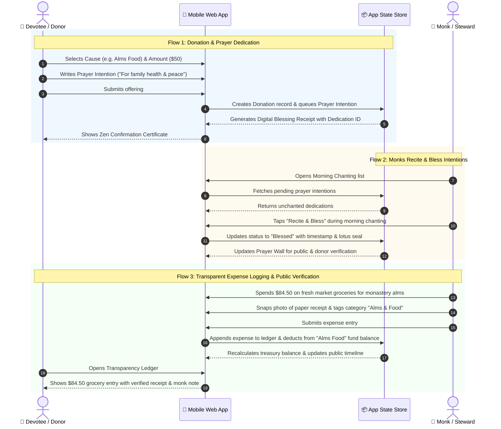
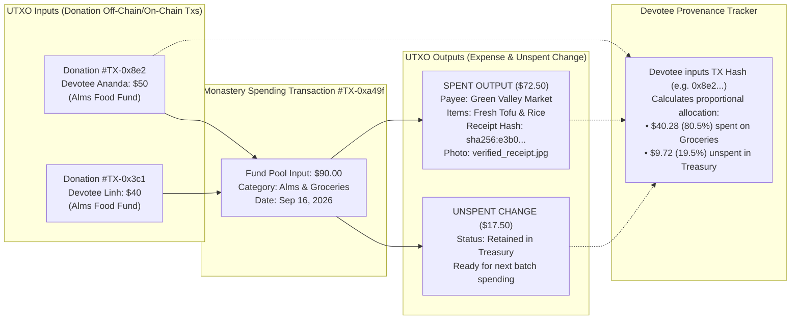
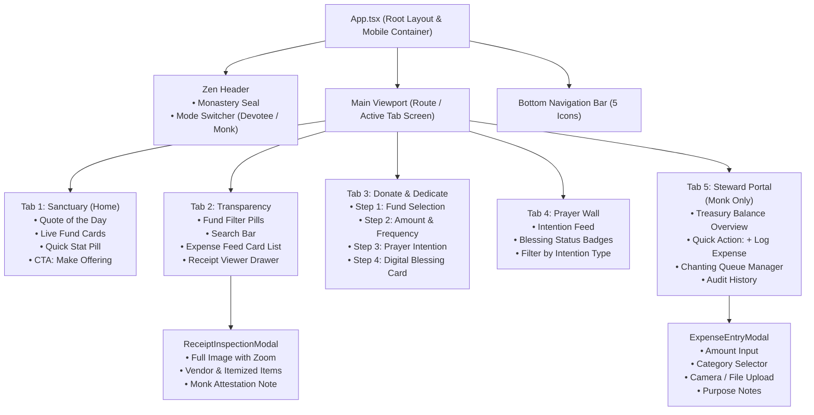
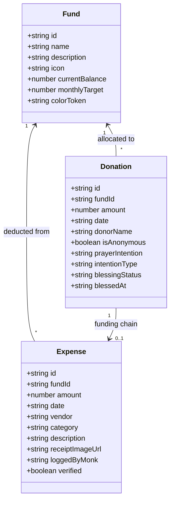

# Solution Architecture: Zen Monastery Transparency & Charity Mobile Web App

## 1. System Overview & Dual-Persona Architecture

---

## 2. End-to-End Data Flow Architecture

---

## 2.1. UTXO Blockchain Ledger & Provenance Engine

## 3. Component Hierarchy & Mobile Navigation

---

## 4. Key Entities & Domain Model

