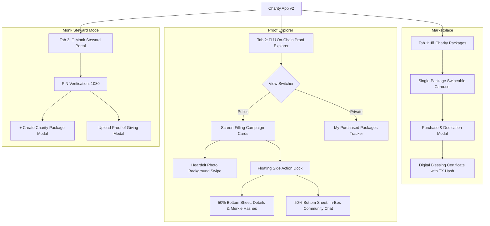

# Technical Design Specification: Charity App Version 2 (Packaged Charity & On-Chain Proof of Giving)

## 1. Executive Summary & Goals

Version 2 of the Lotus Grove Sanctuary Charity Web App evolves the application into an itemized **Charity Packages Marketplace & On-Chain Proof of Giving System**. Monks upload tangible charity packages that people can sponsor, every purchase is assigned a cryptographic transaction hash, and monks record field distributions with heartfelt photographic proofs and verifiable Merkle roots.

### Core Objectives
1. **Charity Packages Marketplace (Tab 1)**: Enable monks to define and offer tangible bundles (e.g. *Winter Warmth & Rice Kit*, *Highland Student Study Pack*, *Elderly Healthcare Pack*). Devotees browse packages via an immersive single-card swipeable carousel (showing 1 package at a time) and buy units with dedication notes and instant cryptographic TX receipts.
2. **On-Chain Proof Explorer (Tab 2)**: Provide screen-filling campaign cards with heartfelt distribution photos as full-card backgrounds. Include floating side-dock action icons for `ℹ️ Details` and `💬 Comments` that smoothly expand into 50% bottom sheet drawers (mutually exclusive, keeping the top half of the photo visible). Allow devotees to privately track their own sponsored packages.
3. **Monk Steward Portal (Tab 3, PIN: 1080)**: Equip monks with administrative workflows to create new charity packages and upload field proofs of giving (distribution photos, units delivered, location, recipient stories, and on-chain block seals).
4. **Multi-Version Architecture**: Version 2 is completely isolated within `versions/v2/` via the workspace version manager, preserving `versions/v1/` intact.

---

## 2. System Architecture & Multi-Version Setup

### Multi-Version Directory Structure
```text
projects/charity-app/
├── .active-version              # Points to "v2"
├── current -> versions/v2       # Symlink to active version
├── versions/
│   ├── v1/                      # Version 1 (Preserved)
│   └── v2/                      # Version 2 (New implementation)
│       ├── src/
│       │   ├── types/           # v2 domain interfaces
│       │   ├── context/         # MonasteryStore with package & proof state
│       │   ├── components/
│       │   │   ├── common/      # Navigation (3 tabs), Header
│       │   │   ├── market/      # Single-package swipeable carousel, BuyModal
│       │   │   ├── proof/       # Screen-filling campaign card, 50% bottom sheet
│       │   │   ├── steward/     # CreatePackageModal, UploadProofModal
│       │   │   └── modals/      # BlessingCertificate, PinModal
│       │   ├── data/            # Seed packages, verified field photos, comments
│       │   └── utils/           # Cryptographic hasher, Merkle root generator
│       ├── ARCHITECTURE.md      # v2 architecture document
│       └── package.json
└── scripts/
    └── version-manager.js       # Workspace orchestrator
```

---

## 3. Key Entities & Domain Data Models

```typescript
// Charity Package Category
export type PackageCategory = 'food' | 'education' | 'medical' | 'winter' | 'emergency';

// Charity Package Listing
export interface CharityPackage {
  id: string;
  title: string;
  description: string;
  category: PackageCategory;
  unitPrice: number;                 // Cost in USD per package (e.g., $25)
  targetUnits: number;               // Total quota requested (e.g., 100)
  fundedUnits: number;               // Units bought by devotees (e.g., 72)
  distributedUnits: number;          // Units delivered with photo proof (e.g., 50)
  itemsIncluded: string[];           // e.g. ["10kg Rice", "Fleece Blanket", "Beanie"]
  coverImageUrl: string;
  bannerGradient: string;
  createdByMonk: string;             // e.g. "Ven. Thich Tam An"
  status: 'active' | 'fully_funded' | 'completed';
  createdAt: string;                 // ISO date
}

// Devotee Purchase Record
export interface PackagePurchase {
  id: string;
  packageId: string;
  packageTitle: string;
  unitsBought: number;
  unitPrice: number;
  totalAmount: number;
  donorName: string;
  isAnonymous: boolean;
  dedicationNote?: string;
  txHash: string;                    // Simulated cryptographic hash (0x...)
  blockNumber: number;               // e.g. 18942
  timestamp: string;
  fulfillmentStatus: 'queued_distribution' | 'fulfilled_with_proof';
  linkedProofBatchId?: string;       // Linked GivingProofBatch ID
}

// Monk Field Distribution Proof Batch
export interface GivingProofBatch {
  id: string;
  packageId: string;
  packageTitle: string;
  unitsDistributed: number;
  location: string;                  // e.g. "Dong Van Highland Village, Ha Giang"
  missionReport: string;             // Field narrative & beneficiary context
  heartfeltPhotos: Array<{
    id: string;
    url: string;
    caption: string;
    beneficiaryNote: string;
  }>;
  distributionDate: string;
  attestingMonk: string;             // e.g. "Ven. Thich Tam An"
  distributionTxHash: string;        // On-chain proof hash (0x...)
  merkleRootHash: string;            // sha256:...
  blockNumber: number;
  comments: CampaignComment[];
}

// Campaign Community Comment / Reflection
export interface CampaignComment {
  id: string;
  campaignId: string;
  authorName: string;
  authorRole: 'monk' | 'devotee';
  monkBadge?: string;
  commentText: string;
  createdAt: string;
}
```

---

## 4. UI/UX Architecture & User Flows

The application is structured into **3 core tabs** on the bottom/top navigation:



### 4.1. Tab 1: Charity Packages (Marketplace)
- **Single Package Viewport**: Displays exactly 1 package at a time to maximize visual focus and mobile usability.
- **Swipe & Navigate**: Touch gestures (swipe left/right), previous/next arrow controls, and progress dots indicator (`Package X of N`).
- **Card Content**: High-resolution package banner, category chip, unit price badge (`$25 / package`), itemized tag chips, dual progress indicators:
  - *Funded Progress*: Total kits bought vs. campaign goal.
  - *Distributed Progress*: Total kits physically delivered with on-chain photo proof.
- **Purchase Modal (`BuyModal`)**:
  - Devotees select quantity (1, 2, 5, or custom).
  - Enter donor name or check "Remain Anonymous".
  - Write prayer dedication note.
  - Generates an immutable cryptographic TX hash (e.g. `0x8a92f0...`) and presents a Zen confirmation certificate.
  - Automatically records purchase to the user's private "My Impact" ledger.

### 4.2. Tab 2: On-Chain Proof Explorer
- **Screen-Filling Campaign Cards**:
  - Each campaign box fills the screen viewport height (`calc(100vh - 220px)`, min 600px) with CSS vertical snap-scrolling (`scroll-snap-type: y mandatory`).
  - **Main Background**: Heartfelt field delivery photo covering the full background with a subtle dark gradient vignette.
  - **Horizontal Photo Swiping**: Swipe left/right directly on the image to view the complete photo gallery of monks delivering items to beneficiaries.
  - **Floating Header**: Displays campaign title, kits delivered badge, and block height.
  - **Floating Side Dock**: Positioned on the bottom-right of the image:
    - `ℹ️ Details`: Toggles the 50% bottom sheet containing the field narrative, kit contents, attesting monk seal, and Merkle root hash.
    - `💬 Comments`: Toggles the 50% bottom sheet containing Sangha reflections, devotee notes, and an inline comment input.
  - **Mutual Exclusivity**: Tapping `💬` collapses Details and opens Comments; tapping `ℹ️` collapses Comments and opens Details; tapping the active icon again collapses the sheet to reveal the full photo.
- **Private Personal Tracker (🌸 My Purchased Packages)**:
  - Toggle to switch from Public Campaigns to Private Ledger.
  - Displays only packages purchased from this device/browser session.
  - Shows package title, quantity bought, total price, personal dedication note, and real-time distribution status (`Queued for Trek` vs `Fulfilled & Delivered in Batch #X`).
  - One-tap button jumping directly to the verified field photo proof.

### 4.3. Tab 3: Monk Steward Portal (PIN: 1080)
- Guarded by monastery PIN `1080`.
- **"+ Create Charity Package" Modal**:
  - Set title, description, category, unit price, target quota, and comma-separated item breakdown.
  - Select cover image and publish immediately to the public marketplace.
- **"Upload Proof of Giving" Modal**:
  - Select active package with pending deliveries.
  - Enter number of units distributed.
  - Enter village location and beneficiary description.
  - Attach field photos (drag-and-drop or preset monastery field photographs).
  - Signs and seals an on-chain proof block, updating linked donor purchases to "Fulfilled".

---

## 5. Cryptographic & On-Chain Ledger Simulation

- **Transaction Hashes**: Generated deterministically using SHA-256 / keccak256 simulation format (`0x` + 64 hex characters) combining package ID, donor timestamp, amount, and nonce.
- **Merkle Roots**: Computed across batch photos and delivery receipts:
  $$\text{MerkleRoot} = \text{sha256}(\text{PhotoHashes} + \text{BeneficiaryManifest} + \text{MonkSeal})$$
- **Block Numbers**: Auto-incrementing simulated blockchain block counter starting from `#18,942`.

---

## 6. Testing & Verification Strategy

1. **Unit Tests**:
   - `utxo.test.ts` & `proof.test.ts`: Test cryptographic hash generation, Merkle root consistency, and purchase-to-proof linkage.
   - `MonasteryStore.test.tsx`: Test `createPackage()`, `purchasePackage()`, `uploadGivingProof()`, and comment appending.
2. **Component Tests**:
   - `MarketplaceCarousel.test.tsx`: Verify 1 package displayed at a time, swipe left/right transitions, and buy modal triggers.
   - `ProofExplorer.test.tsx`: Verify screen-filling campaign cards, mutual exclusivity of 50% bottom sheets (`💬` vs `ℹ️`), and photo carousel navigation.
   - `PersonalPurchases.test.tsx`: Verify private ledger isolation (only user's own purchases displayed).
   - `StewardPortal.test.tsx`: Verify PIN protection, package creation, and proof upload workflows.
3. **Integration & Regression Tests**:
   - End-to-end user purchase flow to monk proof upload and donor fulfillment verification.
   - Full test suite run (`npm test`) to ensure all existing and new tests pass cleanly with 100% success.
